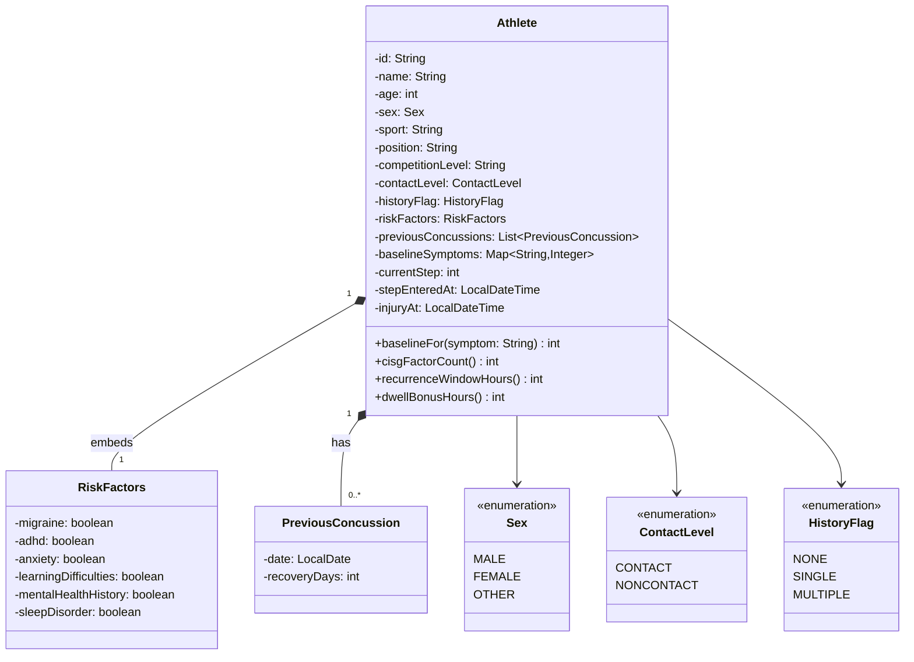
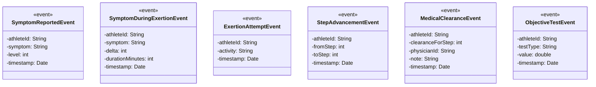
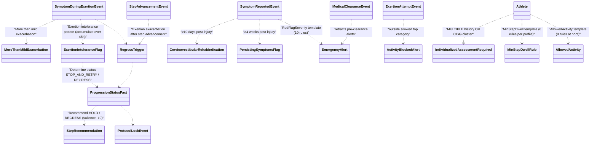
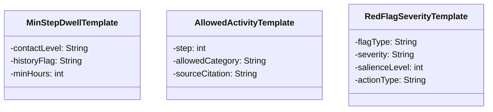
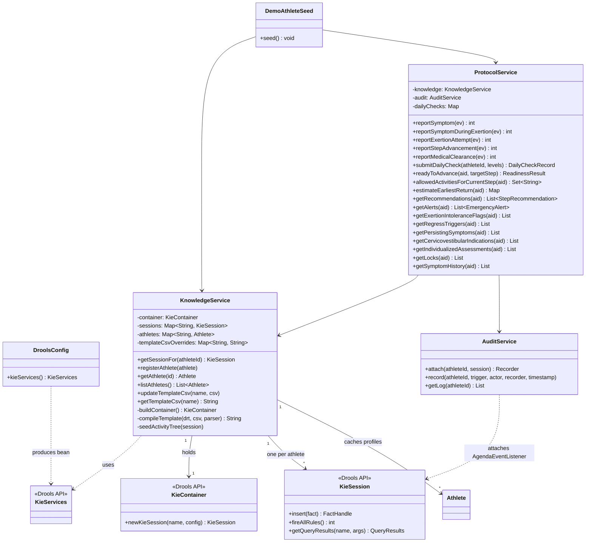
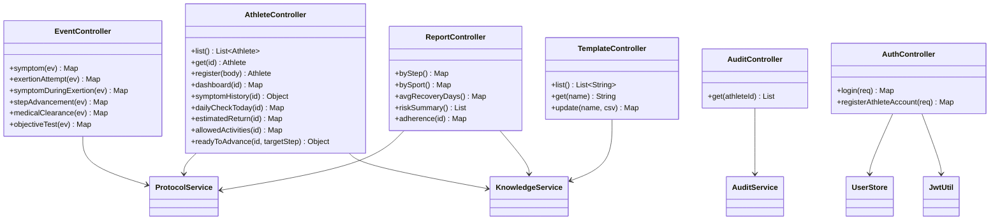
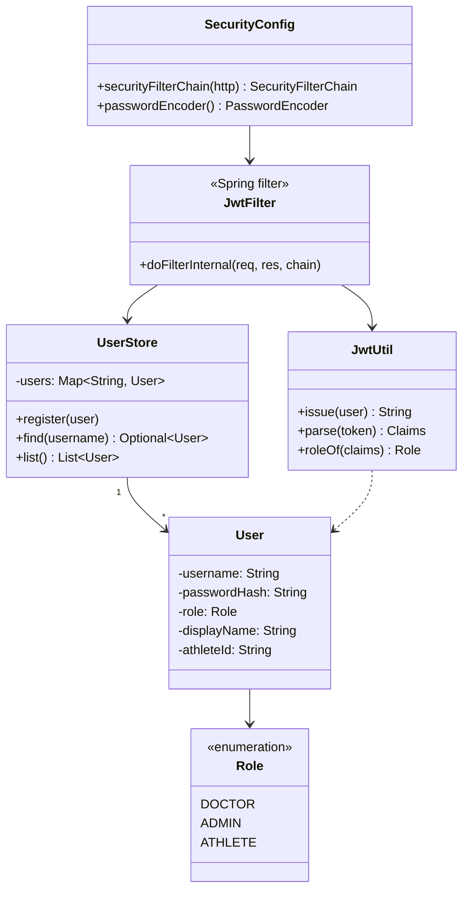

# Class Diagram

Mermaid class diagrams for the SBNZ concussion-protocol project, grouped by concern. Open this file in any Mermaid-aware renderer (GitHub, GitLab, VS Code preview with the *Markdown Preview Mermaid Support* extension) to see the visuals.

---

## 1. Domain model

The core mutable state — what gets registered when a doctor creates a new athlete, and the only fact in the engine that ever gets `modify($a)`-ed.

`Athlete.cisgFactorCount()` counts the `true` flags on `RiskFactors`. `recurrenceWindowHours()` returns 24/36/48 based on that count; `dwellBonusHours()` returns 0/12/24. Both are read directly from rules in [ExertionPattern.drl](../kjar/src/main/resources/rules/cep/ExertionPattern.drl) and [ReadinessQuery.drl](../kjar/src/main/resources/rules/fc/ReadinessQuery.drl).

---

## 2. Events (CEP — time-stamped inputs)

All event classes annotated `@Role(EVENT)` + `@Timestamp("timestamp")` + `@Expires(...)` so Drools tracks them in stream mode. They share an `athleteId` join key but don't inherit from a common base — Drools doesn't need them to.

Annotations on each event class:
- `@Role(Role.Type.EVENT)`
- `@Timestamp("timestamp")` — names the field Drools uses for windowing/temporal operators
- `@Expires(...)` — auto-retraction window. SymptomDuringExertion/Attempt/Advancement = `30d`; SymptomReported = `60d`; MedicalClearance/ObjectiveTest = `365d`.

---

## 3. Derived facts (rule outputs)

What the engine inserts as it reasons over events + profile. None of these are events — they're regular facts with `athleteId` as the join key. The engine retracts a few of them (`ExertionIntoleranceFlag`, `EmergencyAlert`) when their producing conditions cease to hold.

```mermaid
classDiagram
    class MoreThanMildExacerbation {
        -athleteId: String
        -symptom: String
        -delta: int
        -durationMinutes: int
    }
    class ExertionIntoleranceFlag {
        -athleteId: String
        -reason: String
    }
    class RegressTrigger {
        -athleteId: String
        -reason: String
    }
    class PersistingSymptomsFlag {
        -athleteId: String
        -reason: String
    }
    class CervicovestibularRehabIndication {
        -athleteId: String
        -reason: String
    }
    class IndividualizedAssessmentRequired {
        -athleteId: String
        -reason: String
    }
    class EmergencyAlert {
        -athleteId: String
        -flagType: RedFlagType
        -severity: Severity
        -actionType: String
        -message: String
        -insertedAt: Date
    }
    class ActivityBlockedAlert {
        -athleteId: String
        -activity: String
        -currentStep: int
        -message: String
    }
    class ProgressionStatusFact {
        -athleteId: String
        -status: ProgressionStatus
        -reason: String
    }
    class StepRecommendation {
        -athleteId: String
        -action: ActionType
        -currentStep: int
        -recommendedStep: int
        -retryAfterHours: int
        -explanation: String
    }
    class ProtocolLockEvent {
        -athleteId: String
        -lockUntilHours: int
        -reason: String
        -lockedAt: Date
    }
    class ParentCategory {
        -child: String
        -parent: String
    }
    class AllowedActivity {
        -step: int
        -allowedCategory: String
        -sourceCitation: String
    }
    class MinStepDwellRule {
        -athleteId: String
        -minHours: int
    }

    class ProgressionStatus {
        <<enumeration>>
        STOP_TODAY_RETRY_TOMORROW
        REGRESS_TO_STEP_3
    }
    class ActionType {
        <<enumeration>>
        ADVANCE
        HOLD
        REGRESS
        STOP_AND_RETRY
        FREEZE
    }
    class RedFlagType {
        <<enumeration>>
        LOSS_OF_CONSCIOUSNESS
        SEIZURE
        DETERIORATING_CONSCIOUSNESS
        WEAKNESS_IN_LIMBS
        VISIBLE_SKULL_DEFORMITY
        SEVERE_HEADACHE
        REPEATED_VOMITING
        DOUBLE_VISION
        NECK_PAIN
        AGITATION
    }
    class Severity {
        <<enumeration>>
        CRITICAL
        HIGH
        MEDIUM
    }

    ProgressionStatusFact --> ProgressionStatus
    StepRecommendation --> ActionType
    EmergencyAlert --> RedFlagType
    EmergencyAlert --> Severity
```

---

## 4. Causality between events and derived facts

How each derived fact gets produced. Arrows go *from input to output* of a rule.

The three-level FC chain on the right side of this graph (`ExertionIntoleranceFlag` / `RegressTrigger` → `ProgressionStatusFact` → `StepRecommendation`) is what satisfies the "≥3 levels" grading requirement.

---

## 5. Template DTOs

Plain POJOs that mirror CSV row schemas; `KnowledgeService.compileTemplate` parses CSV rows into these, then hands the list to Drools' `ObjectDataCompiler`.

Each row becomes one generated rule, written into a synthetic `.drl` and compiled into the kbase alongside the hand-written rules.

---

## 6. Service layer

Spring beans that wire up Drools and expose REST endpoints. `KnowledgeService` owns the `KieContainer` and per-athlete sessions; `ProtocolService` is the orchestrator that every REST event handler funnels through.

---

## 7. REST controllers

Thin HTTP layer; almost every method delegates to `ProtocolService` or `KnowledgeService`.

---

## 8. Auth (lightweight)

Self-contained JWT setup. No DB; users live in an in-memory `UserStore`.

